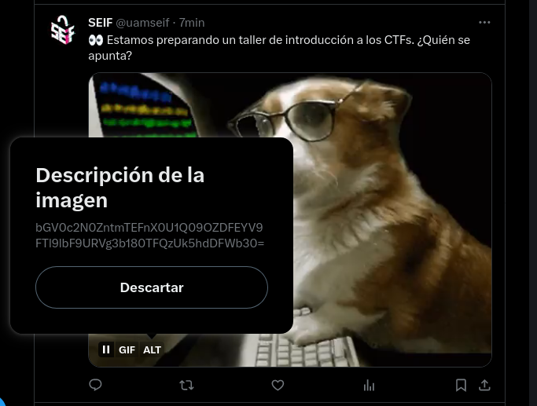

# Jugando a los detectives
- **Categoría:** OSINT
- **Dificultad:** ★☆☆☆☆
- **Autor:**  [navaj0](https://github.com/samu-delucas)

### Descripción
Podrás encontrar la flag oculta en nuestro perfil de Twitter/X?
[@uamseif](https://twitter.com/uamseif)

### Hints
1. Has echado un vistazo a las imágenes que hemos subido?
2. ¿Conoces la etiqueta ALT de Twitter/X?

### Flag
``letsctf{fLAg_E5CONd1Da_EN_el_TEX7o_4LT3RNat1Vo}``

---

## Writeup 
La flag estaba escondida en uno de nuestros tuits, concretamente en el texto alternativo de la imagen:

Decodificando la cadena en base64 se obtiene la flag.

**Flag**: `letsctf{fLAg_E5CONd1Da_EN_el_TEX7o_4LT3RNat1Vo}`