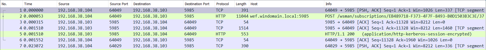
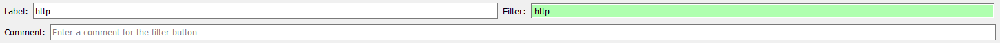
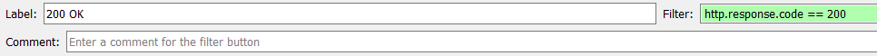
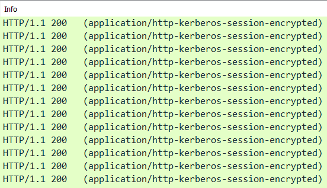
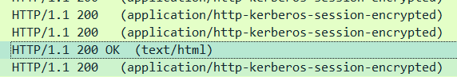
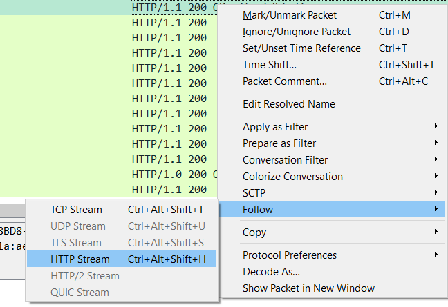

# Ez wireshark
- **Categoría:** Forense
- **Dificultad:** ★☆☆☆☆
- **Autor:** [navaj0](https://github.com/samu-delucas)

_Reto adaptado de picoCTF_

### Descripción
¿Podrás encontrar la flag entre todos estos paquetes que hemos capturado?

### Archivos e instrucciones
- captura.pcapng

### Hints
1. Wireshark te permite filtrar los paquetes. Prueba con el filtro `http`
2. Tal vez te ayude filtrar también por código de respuesta
3. La flag probablemente haya sido codificada con algún encoding conocido

### Flag
`letsctf{n3twoRk_p4ck3ts_f0reNsics}`

---

## Writeup
Como nos dan un archivo `.pcapng`, lo razonable es abrirlo en wireshark.




I can see some `http` traffic. And since my tactic for wireshark in CTFs is to start with this filter:
Podemos ver algo de tráfico `http`, por lo que podemos filtrar con el filtro:



O mucho mejor, con el filtro:



Todo parece tráfico encriptado de kerberos, no?



Bajando en la lista de paquetes encontramos un paquete más razonable.



Si hacemos click en la opción 'Follow', nos llevará al _stream_ correspondiente.



El stream contiene la siguiente información:
```
GET / HTTP/1.1
Host: 18.222.37.134
Connection: keep-alive
Cache-Control: max-age=0
Upgrade-Insecure-Requests: 1
User-Agent: Mozilla/5.0 (Windows NT 10.0; Win64; x64) AppleWebKit/537.36 (KHTML, like Gecko) Chrome/84.0.4147.105 Safari/537.36
Accept: text/html,application/xhtml+xml,application/xml;q=0.9,image/webp,image/apng,*/*;q=0.8,application/signed-exchange;v=b3;q=0.9
Accept-Encoding: gzip, deflate
Accept-Language: en-US,en;q=0.9

HTTP/1.1 200 OK
Date: Mon, 10 Aug 2020 01:51:45 GMT
Server: Apache/2.4.29 (Ubuntu)
Last-Modified: Fri, 07 Aug 2020 00:45:02 GMT
ETag: "2f-5ac3eea4fcf01"
Accept-Ranges: bytes
Content-Length: 47
Keep-Alive: timeout=5, max=100
Connection: Keep-Alive
Content-Type: text/html

Gur synt vf yrgfpgs{a3gjbEx_c4px3gf_s0erAfvpf}
```

La última cadena incluye `yrgfpgs{a3gjbEx_c4px3gf_s0erAfvpf}`, que tiene toda la pinta
de ser la flag. Probando con encodings conocidos resulta ser ROT13 y nos da la flag.

**Flag**: `letsctf{n3twoRk_p4ck3ts_f0reNsics}`.