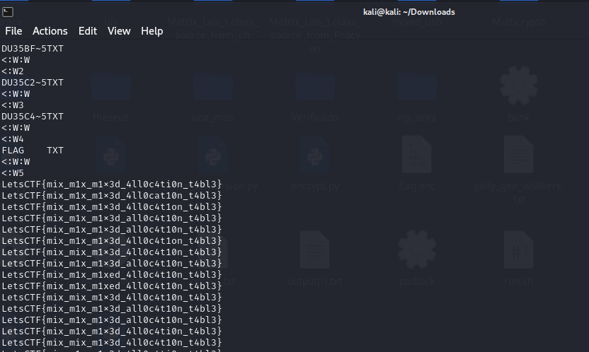

# USaBes
## Description

Me he equivocado y he mezclado una particion, con un US... sí, una partición con un USB, ha hecho una mezcla que flipas y ahora no encuentro el flag. Vamos, que la he liao' parda, ¿sabes?

Archivos:
- `mixed.img`

## Solution
Es un problema que es más sencillo de resolver de lo que parece. La solución más sencilla es hacer un strings mixed.img y con eso veremos todos los strings de la imagen.

Veremos algo así: 

Ristras de flags muy parecidos entre sí. Teniendo eso, ya es cuestión de aplicar la lógica y encontrar y aislar el flag que se encuentra de forma única y no repetida.

## Flag
LetsCTF{mix_m1x_m1x3d_4ll0c4t10n_t4bl3}