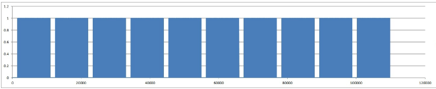
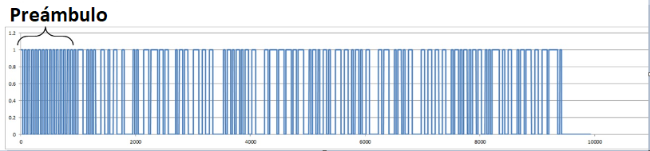

# OOKey
## Description
¿Está todo OOK?

Archivos:
- `paquete.csv`

## Solution

La Modulación Digital de Amplitud, también conocida como Modulación Binaria Sencilla y como OOK (On-Off Keying) denota a la forma más sencilla de modulación ASK que representa datos digitales como la presencia o ausencia de una señal portadora.

Es un método que agrega datos a la amplitud de la señal. Para que sea un poco más fácil de entender, pondremos los datos en ON y OFF. Dado que se trata de un método de modulación muy básico, se utiliza en bastantes dispositivos inalámbricos sospechosos.

A la hora de analizar la capa física de este tipo de comunicación, primero se intenta convertir el csv en un gráfico. Se obtiene una señal como esta:



Al final todo el paquete está almacenado en la repetición de 1 y 0. Solo hay que identificar que cuenta con un preámbulo y un codigo de inicio.

Los preámbulos a menudo se repiten en 1 y 0 y se utilizan para la temporización de símbolos y la sincronización de frecuencia. En este ejemplo, esto corresponde al tiempo durante el cual los 1 y 0 continúan siendo tratados como 1 bit.

El código de inicio se encuentra entre el preámbulo y los datos, y sirve como señal de que los datos comienzan desde ahí. Además, si observa el preámbulo, se podrá ver que la longitud de 1 bit es de 31 símbolos.

Con base en la información anterior, se convierte 31 unos y ceros consecutivos a 1 y 0 simples, y luego simplemente se convierte 8 bits a caracteres como si fuera binario. Si se cree que algo está mal, se puede solucionar cambiando 1 bit y volviendo a decodificarlo.



Se puede resolver el reto con el siguiente script:

```python
fp = open("./paquete.csv", "r")

vals = fp.readlines()

count = 1
pre_val = 0
current = 0

val_bins = []

for i in range(len(vals)):
    pre_val = current
    current = int(vals[i])
    if current == pre_val:
        count = count + 1
    else:
        count = 1

    if count == 31:
        print(pre_val)
        val_bins.append(pre_val)
        count = 1

c = 0
for i in range(len(val_bins)):
    val = int(val_bins[i])
    c = (c << 1) | val
    if i % 8 == 7:
        print(chr(c), end="")
        c = 0

print("")
```

## Flag
LetsCTF{l3ts-g0-s0m3-0n-0ff-key1ng}