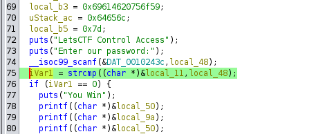
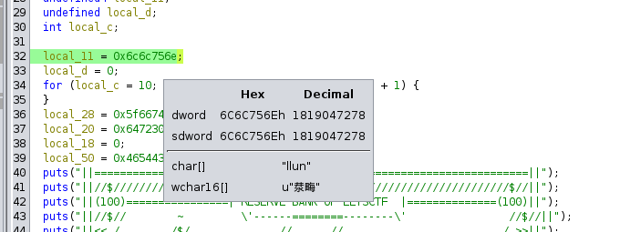

# Asalto al banco
## Description

Necesitamos financiar nuestra organización, y para ello te necesitamos. Deberás asaltar el banco, a ver si nos consigues unas cuantas moneditas...

Archivos
- `bank`

## Solution

Tenemos un binario que nos pide una contraseña, se puede realizar un análisis estático en Ghidra y comprobar donde se realiza la comparación con el la contraseña introducida.

Vemos que la comparación se hace entre las variables local_11 y local_48, por lo que si vamos a la primera de ellas nos encontramos que contiene el valor ‘llun’, es decir que la contraseña que buscamos es ‘null’.

Con eso ya tendríamos nuestro flag.

## Flag
LetsCTF{LetsCTF_r3v3rs3d_c01N} 