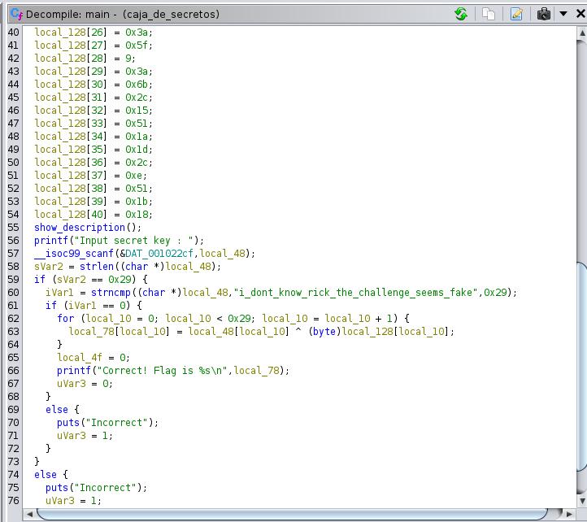

# Caja de Secretos
## Description
He traido la Caja de Secretos de mi familia para venderla a una tienda de empeños, pero sin que la abran y comprueben su contenido no pueden tasarla, ayúdame.

Archivos: 

- `caja_de_secretos`

## Solution

Nos encontramos un ejecutable que pide una contraseña para darnos el flag. Al contrario que otros casos, el flag no viene en las strings ya que se le ha pasado codificado.

Lo más sencillo es realizar un análisis estático con herramientas como Ghidra por ejemplo. Así encontraremos tras decompilar que la expresión a comparar es “i_dont_know_rick_the_challenge_seems_fake"

Ahora podremos ejecutar el archivo y obtener el flag introduciendo la contraseña.

## Flag
LetsCTF{c4n_y0u_buy_4_fl4g_1n_4_p4wnsh0p}