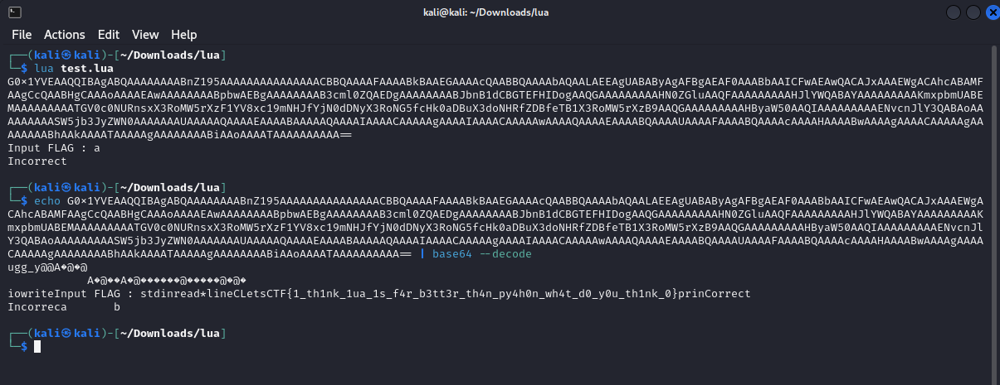

# Vamos LUAnne
## Description

"Es dignidad, dios, ¿acaso no reconoces la dignidad cuando la ves, LUAnne?"

Como correr el archivo main_o.lua en ubuntu

    > sudo apt update
    > sudo apt install lua5.1
    > lua main.lua
    > Input FLAG : LetsCTF{some_flag}
    > Incorrect

Archivos: 

- `main_o.lua`
- `Makefile`

## Solution

En este caso tenemos que descifrar un script de Lua que ha sido ofuscado.

Mirando en la penúltima línea, encontramos una función llamada `CRYPTEDlIIlIIlI` que va a recibir como argumento otra función `CRYPTEDlIIlIlII`.

```lua
return CRYPTEDlIIlIlII(CRYPTEDlIIlIIlI(CRYPTEDlIIllIll, CRYPTEDlIIlIIIl), getfenv(0))()` 
```

Si se observa la función `CRYPTEDlIIlIlII`:

```lua
  local CRYPTEDlIIlIIlI = function(a, b)
      local c = CRYPTEDlIIlIlIl(CRYPTEDlIIlIllI(a))
      local d = c["\99\105\112\104\101\114"](c, CRYPTEDlIIlIllI(b))
      return CRYPTEDlIIlIllI(d)
   end
```

Se puede añadir `print(d)` para ver el valor que tiene justo antes del return. Esto nos dará en la terminal un string codificado en base64 que si decodificamos nos dará el flag:



## Flag
LetsCTF{1_th1nk_1ua_1s_f4r_b3tt3r_th4n_py4h0n_wh4t_d0_y0u_th1nk_0}
