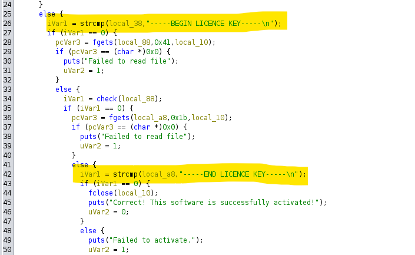

# Verificado
## Description

Este proceso de verificación es demasiado complejo para mi y el archivo que tengo para completar la verificación parece incorrecto. ¿Puedes ayudarme a generar un archivo de verificación correcto?

```console
$ ./licencia key.dat
Failed to activate.
```

Archivos: 

- `licencia`
- `key.dat`

## Solution
Parece ser un binario que comprueba si el archivo es un archivo de licencia válido cuando lo ejecuta dando un nombre de archivo como argumento de línea de comando.

Primero, verifiquemos el procesamiento con Ghidra.



El flujo del proceso es el siguiente:

- fopen al archivo dado como argumento
- fgets de la primera línea y lo compara a ver si equivale a "-----BEGIN LICENCE KEY-----\n"
- fgets a la segunda línea y la procesa con la función check
- fgets de la tercera línea y lo compara a ver si equivale a  "-----END LICENCE KEY-----\n"

Si nos fijamos en la función check parece que la comparación de cadenas se realiza en un proceso largo. Se puede resolver siguiendo este proceso uno por uno, pero es más sencillo utilizar `angr`.

`angr` es una herramienta de análisis binario que utiliza la ejecución simbólica para identificar valores de entrada que satisfacen condiciones dadas mediante el análisis de operaciones como operaciones y ramas condicionales realizadas en el binario.

Para este binario, `puts("Correct! This software is successfully activated!");` identifica el archivo de entrada que llega al proceso llamado dentro de la función principal.

Hay que ver a qué direcciones se desea llegar y a qué direcciones no se quiere llegar, luego se hace un script como el siguiente:

[La dirección básica de `angr` es 0x400000, por lo que la dirección que se muestra como 0x105E6D en Ghidra debe especificarse como 0x405E6D]

```python
import angr

proj = angr.Project("./licencia")
state = proj.factory.entry_state(args=["./licencia", "key.dat"])
simgr = proj.factory.simulation_manager(state)
simgr.explore(find=0x405E6D, avoid=0x405E4B)

try:
    solution = simgr.found[0]
    print(solution.posix.dump_file_by_path("key.dat"))
except IndexError:
    print("Not Found")
```

Con esto obtendremos que el key.dat deberá contener:

```
-----BEGIN LICENCE KEY-----
LetsCTF{5ymb0l1c_4n4li51s_t00l_c0mpl3t3d_5ucc3s5fully_n0_3rr0r}
-----END LICENCE KEY-----
```

## Flag
LetsCTF{5ymb0l1c_4n4li51s_t00l_c0mpl3t3d_5ucc3s5fully_n0_3rr0r}