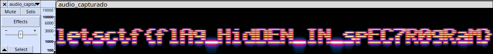

# Oír con los ojos
- **Categoría:** Forense / Stego
- **Dificultad:** ★☆☆☆☆
- **Autor:** [navaj0](https://github.com/samu-delucas)

### Descripción
Hemos recibido este audio de un informador, pero no entendemos lo que dice. 
¿Puedes encontrar el mensaje?

### Archivos e instrucciones
- mensaje.wav

### Hints
1. Tal vez haya formas de visualizar el audio
2. Audacity / Sonic Visualiser

### Flag
``letsctf{flAg_HidDEN_IN_spEC7R0gRaM}``

---

## Writeup 
El audio parece ruido sin sentido, pero si abrimos el archivo con Audacity y
visualizamos el espectrograma obtenemos el mensaje oculto:

También se puede utilizar Sonic Visualiser para este reto.

**Flag**: `letsctf{flAg_HidDEN_IN_spEC7R0gRaM}`