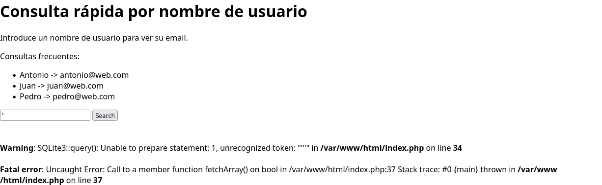

# Sqlazo
- **Categoría:** Web
- **Dificultad:** ★☆☆☆☆
- **Autor:** [navaj0](https://github.com/samu-delucas)

### Descripción
Me han pedido un programa sencillo para consultar la base de datos 
con los correos de los empleados de nuestra empresa a partir de su nombre de usuario.
¿Puedes echarle un vistazo?

### Hints
1. A lo mejor el input no tiene por qué ser un nombre
2. Prueba técnicas básicas de inyección SQL
3. La flag se puede encontrar enumerando todos los usuarios de la base de datos

### Flag
``letsctf{S1mpL3_sqL_INjeCtI0n}``

---

## Writeup 
Este es un reto muy simple de inyección SQL. 

Podemos detectar que la página es vulnerable simplemente introduciendo una
comilla:



La página muestra un error, por lo que probablemente sea vulnerable.

Internamente, podemos imaginarnos cómo es la query que se está ejecutando:
```sql
SELECT * FROM users WHERE username = '$username'
```

Por lo tanto, podemos introducir algo como `' or '1' = '1` de forma que la 
query resultante sea:
```sql
SELECT * FROM users WHERE username = '' or '1' = '1'
```

Como `'1' = '1'` se cumple para todas las entradas de la base de datos, esto 
nos devuelve todos los usuarios, entre los que está escondida la flag:

```
Username: hiDd3N_s3crEt
Email: bGV0c2N0ZntTMW1wTDNfc3ExX0lOamVDdElPbn0=
```

Decodificando el campo email con base64 obtenemos la flag.

**Flag**: `letsctf{S1mpL3_sqL_INjeCtI0n}`
